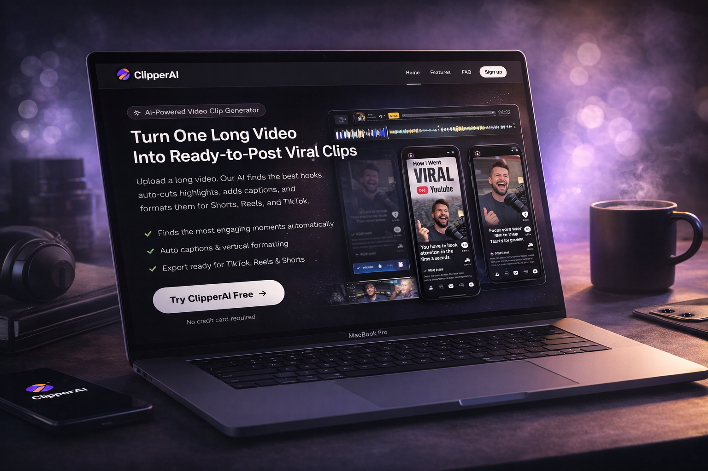

# ClipperAI

Transform your long-form videos into viral clips instantly. Upload once, get dozens of ready-to-post shorts for TikTok, Reels, and YouTube Shorts.



## What is ClipperAI?

ClipperAI is an AI-powered video clipping platform that automatically converts long-duration videos (podcasts, YouTube videos, webinars, livestreams) into bite-sized, social-media-ready clips. Save 10+ hours of manual editing every week.

### Key Features

- **Auto-Framing 9:16** – AI automatically crops and reframes landscape videos to vertical format, keeping the speaker's face in focus without cutting off important content
- **Viral Score AI** – Get an intelligent score for each generated clip based on current social media trends. Know which clips will perform best before posting
- **Automatic Subtitles** – AI generates 98%+ accurate subtitles automatically. Silent videos don't sell—we add captions that keep viewers watching
- **Multi-Format Support** – Works with YouTube videos, Zoom recordings, Podcasts, Livestreams, and more in MP4/MOV format
- **Fast Processing** – Average processing time: 2-5 minutes for a 1-hour video
- **No Watermarks** – All clips are watermark-free and ready for professional brand accounts

## Installation & Setup

### Prerequisites

- Node.js 18+
- npm or yarn package manager
- PostgreSQL or your preferred database

### Quick Start

1. **Clone and install dependencies:**

   ```bash
   cd fronend
   npm install
   ```

2. **Set up environment variables:**
   Create a `.env.local` file in the `fronend` directory with the following:

   ```
   NEXT_PUBLIC_API_URL=http://localhost:3000
   DATABASE_URL=your_database_url
   NEXTAUTH_SECRET=your_secret_key
   NEXTAUTH_URL=http://localhost:3000
   ```

3. **Set up the database:**

   ```bash
   npx prisma migrate dev
   ```

4. **Start the development server:**

   ```bash
   npm run dev
   ```

   The app will be available at `http://localhost:3000`

5. **Build for production:**
   ```bash
   npm run build
   npm run start
   ```

## Project Structure

```
fronend/
├── src/
│   ├── app/              # Next.js app routes (landing, dashboard, auth)
│   ├── components/       # Reusable React components
│   ├── actions/          # Server actions (auth, S3, video processing)
│   ├── lib/              # Utility functions and helpers
│   ├── schemas/          # Validation schemas
│   └── styles/           # CSS files (Tailwind)
├── prisma/               # Database schema and migrations
└── public/               # Static assets
```

## Tech Stack

Built with modern, production-ready technologies:

- **Frontend** – [Next.js](https://nextjs.org) with TypeScript
- **Auth** – [NextAuth.js](https://next-auth.js.org)
- **Database** – [Prisma](https://prisma.io) ORM
- **Styling** – [Tailwind CSS](https://tailwindcss.com)
- **Storage** – AWS S3 for video uploads
- **Processing** – Python backend for AI video processing

## How It Works

1. **Upload** – User selects a video file (MP4, up to 500MB)
2. **Process** – AI analyzes the video, identifies key moments, and generates clip suggestions
3. **Customize** – View generated clips with viral scores and adjust if needed
4. **Download** – Get watermark-free clips ready to post on social media

## Deployment

Deploy easily to Vercel (recommended for Next.js):

```bash
npm install -g vercel
vercel
```

Or follow [Vercel's Next.js deployment guide](https://vercel.com/docs/frameworks/nextjs).

## Support

- **Documentation** – Check our guides and tutorials
- **Issues** – Report bugs or request features
- **Questions** – Contact our support team

---

**Built with ❤️ to save content creators time.**
